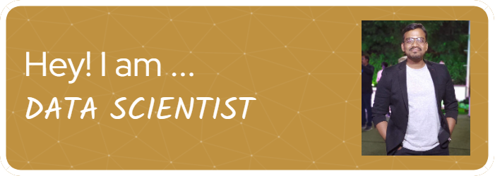

Hi  I'm a Data Scientist & Mechanical Engineer
=====================================

💡Career Objective💡 :- Seeking an entry-level position as a Data Scientist where I can gain hands-on experience while developing cutting-edge solutions for the organization’s needs.
------------------------------------

* ✉️  You can contact me at [p898667641@gmail.com](mailto:p898667641@gmail.com)
* ✉️ :office: [LinkedIn](https://www.linkedin.com/in/Pranavbhawsar/)

### Socials

 <a href="https://www.github.com/Pranavbh1" target="_blank" rel="noreferrer"> 

Innovative forthcoming Data Scientist with experience in WebApp Development , Data Science and Mechanical Engineering(specialisation in Mechatronics). 

🎗️Over NOOB TO PRO DATA SCIENTIST🎗️

• ✒ My devotion is Motorsport ,  Math and Programming💻 💡

• 🧠🖱 I’m addicted to learn and grow every day 🕵️‍♀️

• 💊I am currently collecting knowledge to become DATA SCIENTIST (preferring 🛠 Mechanical stream for DATA SCIENTIST)💉

• 🏆 Got AIR6 (Team - Rustle) in 6th Gkart Design challange(22-27 feb 2019)🥇
    
    -  Held at Buddha International Circuit (Greator Noida)
    
    -  Organised by ISNEE(Indian Society of new Era Engineers) 

• 💬 Ask me about Artificial Intelligence and Programming and Automobile.

### Skills

### Tools | Frameworks 

WebApp : Streamlit

Machine and Deep Learning 

Natural Language Processing

Data Visualization : Matplotlib, Tableau, Seaborn. 

Data Preprocessing : NumPy, Pandas , python .

Integrated Development Environment : Jupyter-Notebook, VScode .

### Badges

<b>My GitHub Stats</b>

### Support Me

---
> Knowledge is power. We all agree to that. Knowledge is the manifestation of power already inside in man.
>
> 
> Whatever makes you weak – physical, intellectual or mental. Abandon it like poison.

— Pranav(Follower of SWAMI VIVEKANANDA)

